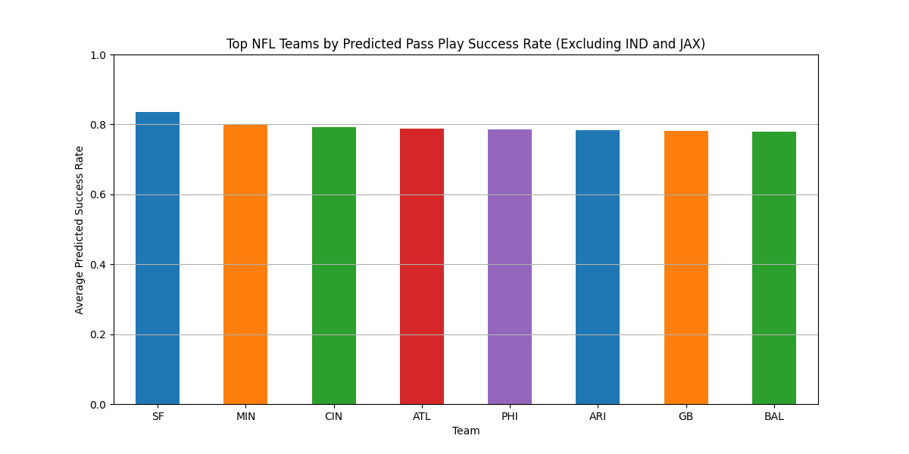

# NFL Pass Play Success Rate Analysis

This project focuses on analyzing the predicted pass play success rates for NFL teams based on play-by-play data from the 2024 season. The analysis highlights top-performing teams and visualizes the results using bar charts, including versions with and without team logos for enhanced clarity.

## Project Overview

The objective of this analysis is to identify the NFL teams with the highest predicted pass play success rates, excluding certain teams (e.g., IND and JAX). The project leverages advanced machine learning models to make predictions based on features derived from play-by-play data.

### Key Features:

- **Data Source**: Play-by-play data from the 2024 NFL season.
- **Analysis Scope**: Predicted pass play success rates for all NFL teams.
- **Exclusions**: Teams like IND and JAX were excluded to maintain consistency.
- **Visualization**: Two types of visualizations:
  1. Bar chart without logos.
  2. Enhanced bar chart with team logos for better presentation.

## Files in the Repository

- **`Best Passing plays.py`**: The main script used for data processing, prediction, and visualization of pass play success rates.
- **`play_by_play_2024.csv`**: The dataset containing play-by-play statistics for the 2024 NFL season.
- **`TEAM PASSING.png`**: Visualization showing top NFL teams by predicted pass play success rate.
- **`best passing by team.png`**: Enhanced bar chart including team logos for visual appeal.

## Installation

To run this project, you need Python installed along with the required packages:

```bash
pip install matplotlib pandas numpy scikit-learn
```

## How to Run

1. Clone the repository:

```bash
git clone https://github.com/chukse/nfl-pass-play-success-analysis.git
```

2. Navigate to the project directory:

```bash
cd nfl-pass-play-success-analysis
```

3. Run the main analysis script:

```bash
python Best\ Passing\ plays.py
```

This will process the data and generate visualizations of the top teams based on their predicted pass play success rates.

## Visualizations

### 1. Top NFL Teams by Predicted Pass Play Success Rate (Excluding IND and JAX)



### 2. Top NFL Teams by Predicted Pass Play Success Rate (With Logos)


## Methodology

The project uses a machine learning model trained on various features extracted from the play-by-play data, including:

- Down and distance
- Defensive alignment
- Quarterback dropback type
- Pass depth and receiver separation metrics

The predictions are then aggregated to compute the average success rate for each team.

## Conclusion

The analysis provides insights into which NFL teams are performing best in passing plays based on predicted success rates. This can be useful for analysts, coaches, and sports bettors looking to understand team strengths and strategize accordingly.

## Author

**Chukwuka Egbuchunam**

Feel free to reach out with any questions or suggestions for improvements.

## License

This project is licensed under the MIT License - see the LICENSE file for details.
